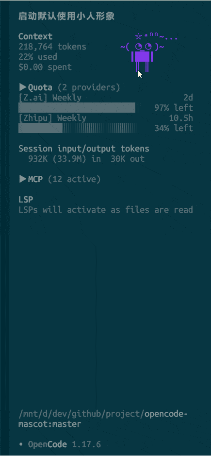

# 🐱 opencode-mascot

> OpenCode TUI mascot plugin framework — bring your terminal to life

Customizable ASCII mascots that breathe, walk, sleep, get launched across the screen, blown up by falling bombs, then quietly reassemble themselves.

[English](./README.md) | [简体中文](./README_zh-CN.md)

## 🏠 Home Page


## 💼 Work Page



---

## ✨ Features

### 🎭 Built-in Characters (3)

| Character | Description | Color |
|-----------|-------------|-------|
| **yueer** | Purple-haired girl with an ahoge, tsundere style, default mascot | `#8B7EB8` lavender |
| **baozi** | A steaming hot bun, warm and cozy | `#D4885A` warm orange |
| **cat** | Orange tabby cat — purring, kneading, tail-swishing | `#FFA500` orange |

Each character includes **5 expression frames**: default / blink / happy / thinking / sleeping

---

### 🎬 Automatic Animations (16)

**Built-in (shared by all characters):**

| # | Animation | Trigger | Effect |
|---|-----------|---------|--------|
| 1 | Blink | Random (30% / 2.5s) | Switch to blink frame for 150ms |
| 2 | Random expression | Every 8s | Cycles expressions while idle |
| 3 | Breathing | Every 3s | Lines shift up one row, simulating breathing |
| 4 | Walking | Every 20-40s | Sways left and right (14-step path) |
| 5 | Jumping | Every 20-40s | Bounces -2 → -1 → 0 |
| 6 | Sleep | Idle 90-120s | Auto-closed eyes + alien-text Zzz |

**yueer exclusive:**

| # | Animation | Trigger | Effect |
|---|-----------|---------|--------|
| 7 | Ahoge sparkle | Random (25% / 1.5s) | ☆ ↔ ★ |
| 8 | Happy head sway | happy state | Face sways left/right + ahoge synced |
| 9 | Thinking foot stomp | thinking state | Left foot fixed, right foot stomps ║↔_ |
| 10 | Thinking face shift | thinking state | 6 expressions rotate (o_o / O_O / >_o / o_< / ⊙_⊙ / ◔_◔) |
| 11 | Alien text bubble | busy/thinking | 12 alien-text phrases rotate |
| 12 | Drag arm flail | While dragging | Arms ┃███┃ ↔ ╱███╲ |
| 13 | Jump arm flail | While jumping | Same as above |

**baozi exclusive:**

| # | Animation | Trigger | Effect |
|---|-----------|---------|--------|
| 14 | Steam | Continuous | 4 steam patterns rotate |
| 15 | Alien text bubble | busy/thinking | 12 alien-text phrases rotate |
| 16 | Drag panic | While dragging | `( °□° )` |

**cat exclusive:**

| # | Animation | Trigger | Effect |
|---|-----------|---------|--------|
| 17 | Tail swish | Every 0.6s | Tail `|_)` ↔ `|~)` |
| 18 | Ear twitch | Random (20% / 2.5s) | Ear `/\` → `/╲` |
| 19 | Pupil dilate | Random (15% / 4s, idle) | Eyes `o.o` → `@.@` |
| 20 | Kneading | idle state | Paws alternate `/||  |\` ↔ `/|  ||\` |
| 21 | Purr bubble | busy/thinking | 12 purr phrases rotate (purrr~/mrrrow~/nyaa~) |
| 22 | Drag bristle | While dragging | Ears bristle `/╲╱╲` + shocked face `>.<` |

---

### 🖱️ Interactions (5)

| # | Action | Effect |
|---|--------|--------|
| 1 | **Alt + drag** | Freely move the mascot anywhere |
| 2 | **Double-click** | Cycle through characters (within 300ms) |
| 3 | **Drag color flash** | Body flashes through 8 highlight colors at 100ms, locks on release |
| 4 | **Drag alien text** | Pink "let go of me" alien text appears above head while dragging |
| 5 | **Drag panic** | `( °□° )` face + arms flailing while dragging |

---

### 🫣 Peek-a-Boo System (Work Page)

| # | Action | Effect |
|---|--------|--------|
| 1 | Drag to left edge | Mascot hides, only 2 rows visible |
| 2 | Release at edge | Auto peek cycle (peeks 2 more rows every 1.2s, then retreats) |
| 3 | Click / start working | Slides back from edge + bounce |

---

### 💥 Random Events (3)

| # | Event | Trigger | Effect |
|---|-------|---------|--------|
| 1 | **Fall apart** | Jump landing 40% / bounce 50% | Lines scatter → reassemble after 1.5s |
| 2 | **Bomb drop** | 10% chance replacing walk (idle) | Fuse burns ✦/◌ + countdown ³·→²·→¹· → red/orange/yellow flash explosion + `ᵇᵒᵒᵐ~💥` → reassemble |
| 3 | **Scatter & assemble** | Startup / switch to work page | Lines start from random positions, 15-frame linear interpolation to home |

---

### 📦 Prop System (3 props)

| Prop | Size | Trigger | Position | Description |
|------|------|---------|----------|-------------|
| **Monitor** | 16×5 | busy (65%) | side-right | Terminal showing `~$ᵒᵖᵉⁿᶜᵒᵈᵉ` + 20 random alien-text status frames (thinking/writing/git/bug/npm/compile/test/refactor/deploy/merge/lint/format/review/oops/hmm/help) |
| **Pad** | 18×9 | busy (35%) + idle (40%) | front (character hidden) | Mini character plays games inside: Snake / Tetris / 2048, always game over after a few moves (rookie gamer), 15-frame loop |
| **Box** | 14×8 | idle (5%, once/min) + home startup | side-left | Isometric 3D box with `ᵇᵒˣ` alien text. 4-frame loop: closed → shake → open (character crouches inside) → peek out |

**Busy pacing:** Character paces anxiously (±3 steps, walk 3s / pause 2s) while monitor is shown. Monitor stays still.

**Landing animation:** When a prop appears, character falls to the work area with easeInQuad curve (500ms).

**Home startup ceremony:** Character hides → box drops from above (easeInQuad 500ms) → 2s later shake → 6s later box disappears + character drops to position.

---

### 🔄 Phase Machine (Work Page)

A 4-phase animation cycle triggered on `session busy`:

| Phase | Duration | Animation |
|-------|----------|-----------|
| **Phase 1** | ~15s | Character jumps onto pc-case → paces → golden ladder drops from top → climbs up → monitor falls from ceiling → character dives into the case (sinks 3 rows, zIndex drops below case) |
| **Phase 2** | 60s | Monitor shows alien-text work status + **vibe coding** rainbow text (`ᵛⁱᵇᵉ ᶜᵒᵈⁱⁿᵍ` cycling 6 colors every 300ms) above monitor → character emerges from case left side and stands still |
| **Phase 3** | 30s | **Pad peek-a-boo**: pad slides out from left with 4-step peek sequence, character's eyes glance left (`<_<`) + paces toward pad simulating pulling it out. Three props on screen simultaneously (pc-case + monitor + pad) |
| **Cycle** | → Phase 1 | Pad slides out → character drops down (easeInQuad 500ms) → 800ms landing pause → bounce jump back to pc-case |

**Power line:** During phase 1 & 2, a gray `━` line extends from the pc-case right side to the sidebar edge (clipped by edge).

**Race condition protection:** `phaseSessionId` token invalidates stale callbacks on new busy/idle events.

---

### 🔄 Auto-Update

- Checks npm latest version on startup → semver compare → `npm pack` download → `tar` extract overwrite
- File lock prevents concurrency (30s expiry auto-cleanup)
- Syncs opencode plugin manifest version to prevent rollback on restart
- On successful update: mascot jumps to celebrate + alien-text version number `ᵘᵖ→⁰·⁵·¹`

---

### 🎵 State Sync

| Trigger | Effect |
|---------|--------|
| session busy | Alien text bubble + 8-color highlight flash |
| session thinking | Foot stomp + face shift + alien text |
| session happy | Head sway celebration 3s |
| session idle timeout | Auto-sleep + alien-text Zzz (`zᶻ...` → `zᶻᶻ...` → `zᶻᶻᶻ...`) |
| Drag while sleeping | Startles awake to idle + arm flail panic |

> All states default to yueer. Double-click to manually switch to baozi.

---

### 🚀 Startup Effects

- Version number shown 2s after startup as alien-text `ᵛ⁰·⁵·¹` (3s duration)
- Home page mascot appears at random horizontal position
- Work page scatter-assemble animation on first message / `opencode -c`

---

## 📦 Installation

Add to `~/.config/opencode/tui.json`:

```json
{
  "plugin": ["@mingxy/opencode-mascot@latest"]
}
```

Restart opencode. The plugin auto-updates to the latest version.

## 🛠️ Tech Stack

- **TypeScript** ESM
- **@opentui/solid** — SolidJS reactive TUI rendering
- **@opencode-ai/plugin** — OpenCode plugin API
- Zero runtime dependencies (peer dep only)
- TypeScript type-checked

## 📂 Project Structure

```
opencode-mascot/
├── tui.tsx                          # Plugin entry, registers slots + startup
├── src/
│   ├── core/
│   │   ├── types.ts                 # MascotPack / MascotState / Effect types
│   │   ├── ascii-renderer.tsx       # Core rendering engine (574 lines, 16+ animations)
│   │   ├── mascot-loader.ts         # Built-in character loader
│   │   ├── celebration-bus.ts       # Module-level event bus
│   │   ├── updater.ts               # npm auto-update
│   │   └── logger.ts                # File logger
│   ├── components/
│   │   ├── home-mascot.tsx          # Home page mascot
│   │   └── sidebar-mascot.tsx       # Work page mascot (peek-a-boo)
│   └── builtins/
│       ├── yueer/                   # yueer (frames + effects)
│       ├── baozi/                   # baozi (frames + effects)
│       └── cat/                     # cat (frames + effects)
```

## 🎨 Custom Characters

Define a `MascotPack`:

```typescript
import type { MascotPack } from "@mingxy/opencode-mascot/types";

const myMascot: MascotPack = {
  name: "@mingxy/mascot-custom",
  displayName: "Kitty",
  version: "0.1.0",
  author: "you",
  description: "My custom mascot",

  frames: {
    default: ["  /\\_/\\  ", " ( o.o ) ", "  > ^ <  "],
    blink:   ["  /\\_/\\  ", " ( -.- ) ", "  > ^ <  "],
    happy:   ["  /\\_/\\  ", " ( ^ω^ ) ", "  > ^ <  "],
    sleeping:["  /\\_/\\  ", " ( -.- ) ", "  > z z  "],
  },

  colors: { defaultFg: "#FFB6C1" },

  effects: {
    signals: [],
    timers: [],
    render(lines, ctx) { return lines; },
  },
};
```

All built-in animations (blink/breath/walk/jump/sleep/drag/color-flash/bomb/fall-apart/reassemble) **work automatically**.

## 📊 Capabilities

| Category | Count |
|----------|-------|
| Built-in characters | 3 |
| Expression frames | 5 / character |
| Auto animations | 22 |
| Props (monitor/pad/box) | 3 |
| Prop animation frames | 39 (20+15+4) |
| Phase machine animations | 4 (jump+ladder+dive / vibe+stand / pad-peek / cycle) |
| Interactions | 5 |
| Peek-a-boo behaviors | 3 |
| Random events | 3 |
| Busy behaviors (pacing/stomp/flash) | 3 |
| Idle events (pad/box/sleep) | 3 |
| Landing animations | 2 (busy/idle + home startup) |
| Alien text phrases | 24 (12/character) |
| Flash colors | 8 |
| Drag alien text | 6 |
| Pad mini-games | 9 (3 games/character × 3 characters) |
| **Total** | **70+** |

## 📄 License

MIT © [mingxy](https://github.com/mengfanbo123)

## 🔗 Links

- [GitHub](https://github.com/mengfanbo123/opencode-mascot)
- [npm](https://www.npmjs.com/package/@mingxy/opencode-mascot)
- [中文文档](./README_zh-CN.md)
